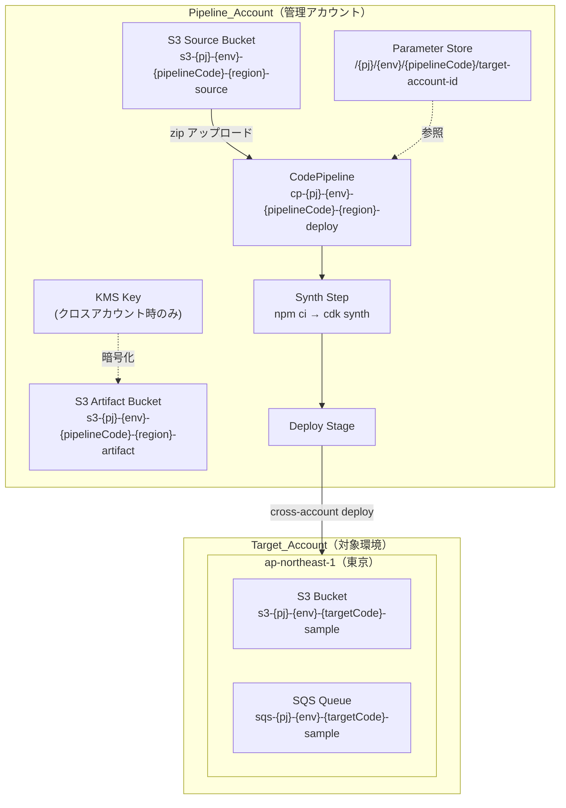
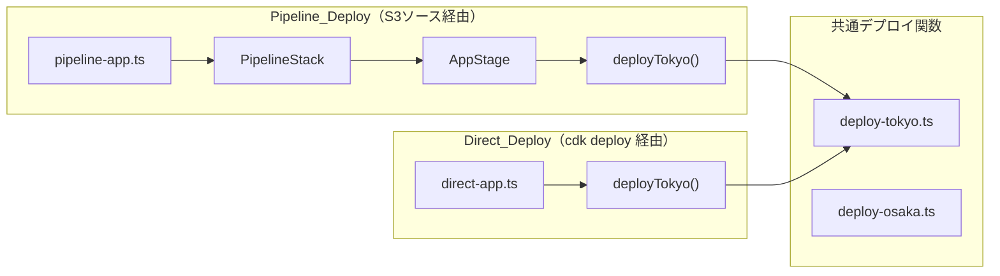
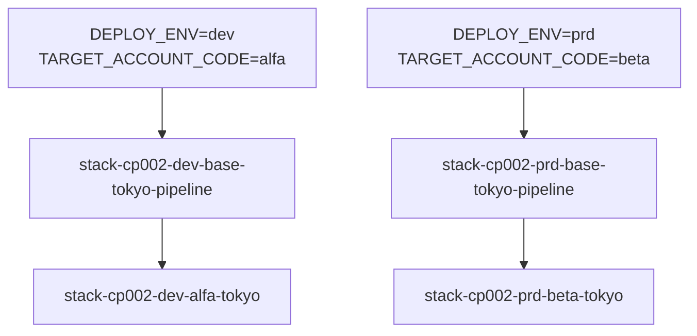

# 設計ドキュメント: CDK Pipeline Sample

## Overview

本プロジェクトは、AWS CDK Pipelines を使用したクロスアカウントデプロイのサンプル実装である。「1パイプライン＝1環境＝1リージョン」のアーキテクチャを採用し、環境変数を変更するだけで独立したパイプラインを環境ごとに作成できる。

S3 バケットをソースとしたパイプライン実行により、Pipeline_Account から指定された Target_Account へリソースをデプロイする。

開発効率向上のため、パイプライン経由（Pipeline_Deploy）と `cdk deploy` コマンドによる直接デプロイ（Direct_Deploy）の2つのエントリポイントを提供する。

デプロイ先アカウント情報は Pipeline_Account の AWS Systems Manager Parameter Store で一元管理する。

## Architecture

### 全体アーキテクチャ図



### 2つのデプロイパス



### 環境変数による切り替え



## Components and Interfaces

### ファイル構成

```
cdk/
├── bin/
│   ├── pipeline-app.ts        # Pipeline_Deploy エントリポイント
│   └── direct-app.ts          # Direct_Deploy エントリポイント
├── lib/
│   ├── pipeline/
│   │   ├── env.ts             # 環境変数の集中管理
│   │   ├── stack-pipeline.ts  # PipelineStack 定義
│   │   └── stage-app.ts       # AppStage 定義
│   └── resources/
│       ├── tokyo/
│       │   ├── deploy-tokyo.ts        # 東京デプロイ関数
│       │   └── stack-resource-tokyo.ts
│       └── osaka/
│           ├── deploy-osaka.ts        # 大阪デプロイ関数
│           └── stack-resource-osaka.ts
cfn/
├── pipeline-buckets.yaml      # S3 Source Bucket
├── parameter-store.yaml       # SSM Parameter Store
└── README.md
```

### コンポーネント詳細

#### 1. env.ts（環境変数の集中管理）

```typescript
// Region name to AWS region mapping
const REGION_MAP: Record<string, string> = {
  tokyo: "ap-northeast-1",
  osaka: "ap-northeast-3",
};

// Environment variables
export const projectName = process.env.PROJECT_NAME || "cp002";
export const deployEnv = process.env.DEPLOY_ENV || "dev";
export const deployRegion = process.env.DEPLOY_REGION || "tokyo";
export const awsRegion = REGION_MAP[deployRegion] || "ap-northeast-1";
export const cdkDefaultAccount = process.env.CDK_DEFAULT_ACCOUNT;

// Account codes (free-form: base, alfa, beta, etc.)
export const pipelineAccountCode = process.env.PIPELINE_ACCOUNT_CODE || "base";
export const targetAccountCode = process.env.TARGET_ACCOUNT_CODE || "alfa";

// Derived values
export const ssmPrefix = `/${projectName}/${deployEnv}/${pipelineAccountCode}`;
export const sourceBucketName = `s3-${projectName}-${deployEnv}-${pipelineAccountCode}-${deployRegion}-source`;
export const artifactBucketName = `s3-${projectName}-${deployEnv}-${pipelineAccountCode}-${deployRegion}-artifact`;
export const sourceObjectKey = "cdk-pipeline-002-main.zip";
export const sourceExtractDir = "cdk-pipeline-002-main";
```

#### 2. pipeline-app.ts（Pipeline_Deploy エントリポイント）

```typescript
#!/usr/bin/env node
import * as cdk from "aws-cdk-lib";
import { PipelineStack } from "../lib/pipeline/stack-pipeline";
import { projectName, deployEnv, deployRegion, awsRegion, pipelineAccountCode } from "../lib/pipeline/env";

const app = new cdk.App();

new PipelineStack(app, `stack-${projectName}-${deployEnv}-${pipelineAccountCode}-${deployRegion}-pipeline`, {
  env: {
    account: process.env.CDK_DEFAULT_ACCOUNT,
    region: awsRegion,
  },
  stackName: `stack-${projectName}-${deployEnv}-${pipelineAccountCode}-${deployRegion}-pipeline`,
});

app.synth();
```

#### 3. direct-app.ts（Direct_Deploy エントリポイント）

```typescript
#!/usr/bin/env node
import * as cdk from "aws-cdk-lib";
import { deployTokyo } from "../lib/resources/tokyo/deploy-tokyo";
import { deployOsaka } from "../lib/resources/osaka/deploy-osaka";
import { deployEnv, deployRegion, awsRegion, cdkDefaultAccount, targetAccountCode } from "../lib/pipeline/env";

const app = new cdk.App();

const deployProps = {
  env: {
    account: cdkDefaultAccount,
    region: awsRegion,
  },
  envName: deployEnv,
  accountCode: targetAccountCode,
};

if (deployRegion === "tokyo") {
  deployTokyo(app, deployProps);
} else if (deployRegion === "osaka") {
  deployOsaka(app, deployProps);
}

app.synth();
```

#### 4. stack-pipeline.ts（PipelineStack）

主要なポイント:
- Parameter Store から Target Account ID を取得（環境変数がある場合は優先）
- クロスアカウント判定に基づき KMS キーを作成
- Synth Step で環境変数を渡し、CodeBuild 内での SSM 参照を回避
- EventBridge Rule で S3 アップロードをトリガー

```typescript
// Parameter Store から Target Account 情報を取得（環境変数がある場合はそちらを優先）
const targetAccountId = process.env.TARGET_ACCOUNT_ID 
  || ssm.StringParameter.valueFromLookup(this, `${ssmPrefix}/target-account-id`);

// クロスアカウント判定
const isCrossAccount = this.account !== targetAccountId;

// Artifact Bucket 用の KMS キー（クロスアカウント時に必要）
const artifactKey = isCrossAccount
  ? new kms.Key(this, "ArtifactKey", { ... })
  : undefined;

// CodePipeline
const pipeline = new CodePipeline(this, "Pipeline", {
  crossAccountKeys: isCrossAccount,
  synth: new ShellStep("Synth", {
    env: {
      PROJECT_NAME: projectName,
      DEPLOY_ENV: deployEnv,
      DEPLOY_REGION: deployRegion,
      PIPELINE_ACCOUNT_CODE: pipelineAccountCode,
      TARGET_ACCOUNT_CODE: targetAccountCode,
      TARGET_ACCOUNT_ID: targetAccountId,
    },
    commands: [...],
  }),
});
```

#### 5. stage-app.ts（AppStage）

```typescript
export class AppStage extends cdk.Stage {
  constructor(scope: Construct, id: string, props: AppStageProps) {
    super(scope, id, props);

    const deployProps = {
      env: props.env,
      envName: props.envName,
      accountCode: props.accountCode,
    };

    if (props.regionName === "tokyo") {
      deployTokyo(this, deployProps);
    } else if (props.regionName === "osaka") {
      deployOsaka(this, deployProps);
    }
  }
}
```

#### 6. deploy-tokyo.ts / deploy-osaka.ts（共通デプロイ関数）

```typescript
export function deployTokyo(scope: Construct, props: DeployProps): void {
  new TokyoResourceStack(scope, `stack-${projectName}-${props.envName}-${props.accountCode}-tokyo`, {
    env: props.env,
    envName: props.envName,
    accountCode: props.accountCode,
    stackName: `stack-${projectName}-${props.envName}-${props.accountCode}-tokyo`,
  });
}
```

## Data Models

### 環境変数

| 変数名 | 説明 | デフォルト |
|--------|------|----------|
| `PROJECT_NAME` | プロジェクト名 | cp002 |
| `DEPLOY_ENV` | 環境コード | dev |
| `DEPLOY_REGION` | リージョン名 | tokyo |
| `PIPELINE_ACCOUNT_CODE` | パイプラインアカウントコード | base |
| `TARGET_ACCOUNT_CODE` | ターゲットアカウントコード | alfa |
| `CDK_DEFAULT_ACCOUNT` | AWS アカウント ID | - |
| `TARGET_ACCOUNT_ID` | ターゲットアカウント ID（CodeBuild 用） | - |

### Parameter Store パラメータ構造

| パラメータ名 | 説明 | 例 |
|-------------|------|-----|
| `/{pj}/{env}/{accountCode}/pipeline-account-id` | パイプラインアカウント ID | `111111111111` |
| `/{pj}/{env}/{accountCode}/target-account-id` | ターゲットアカウント ID | `222222222222` |

### 命名規則

| リソース種別 | パターン |
|-------------|---------|
| Pipeline Stack | `stack-{pj}-{env}-{pipelineCode}-{region}-pipeline` |
| CodePipeline | `cp-{pj}-{env}-{pipelineCode}-{region}-deploy` |
| Source Bucket | `s3-{pj}-{env}-{pipelineCode}-{region}-source` |
| Artifact Bucket | `s3-{pj}-{env}-{pipelineCode}-{region}-artifact` |
| Resource Stack | `stack-{pj}-{env}-{targetCode}-{region}` |
| Sample S3 | `s3-{pj}-{env}-{targetCode}-sample` |
| Sample SQS | `sqs-{pj}-{env}-{targetCode}-sample` |

## クロスアカウントデプロイ

### 前提条件

1. **Pipeline Account**: `cdk bootstrap` 実行済み
2. **Target Account**: `cdk bootstrap --trust PIPELINE_ACCOUNT_ID` 実行済み

```bash
# Target Account で実行
cdk bootstrap aws://TARGET_ACCOUNT_ID/ap-northeast-1 \
  --trust PIPELINE_ACCOUNT_ID \
  --cloudformation-execution-policies arn:aws:iam::aws:policy/AdministratorAccess
```

### KMS キーの自動作成

クロスアカウント時は Artifact Bucket に KMS 暗号化が必要。`isCrossAccount` フラグに基づき自動的に KMS キーを作成する。

## Error Handling

| エラーケース | 原因 | 対応 |
|-------------|------|------|
| `Artifact Bucket must have a KMS Key` | クロスアカウントで S3_MANAGED 暗号化を使用 | KMS キーを作成（自動対応済み） |
| `ssm:GetParameter not authorized` | CodeBuild に SSM 権限がない | 環境変数で TARGET_ACCOUNT_ID を渡す（自動対応済み） |
| `cdk bootstrap` エラー | Target Account で trust 未設定 | `--trust` オプションで bootstrap |
| `valueFromLookup` がダミー値を返す | Parameter Store にパラメータが存在しない | CFn で事前作成 |

## セキュリティ考慮事項

### Git に含めないファイル

`.gitignore` で以下を除外:
- `cdk.context.json` - アカウント ID がキャッシュされる
- `cdk.out/` - synth 出力

### 機密情報の管理

- アカウント ID は Parameter Store から動的取得
- コードにハードコードしない
- 環境変数で渡す場合も Git にコミットしない
