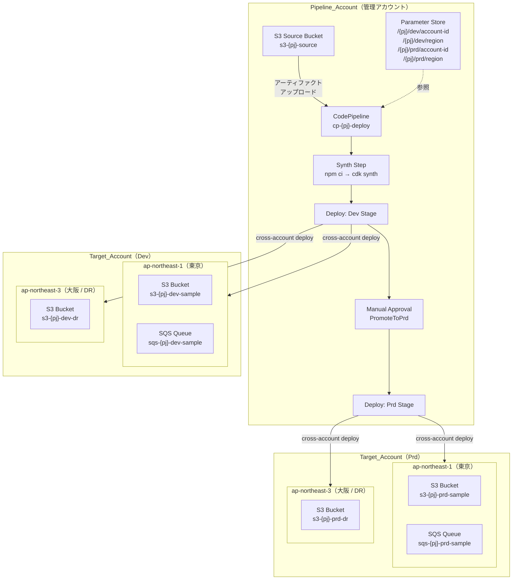
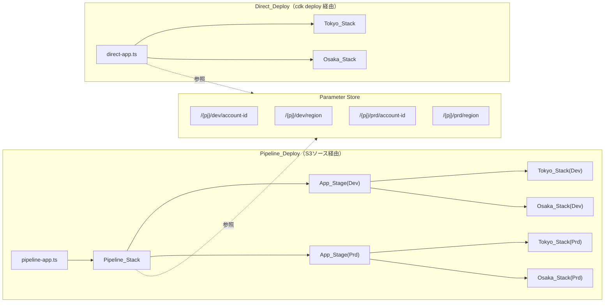
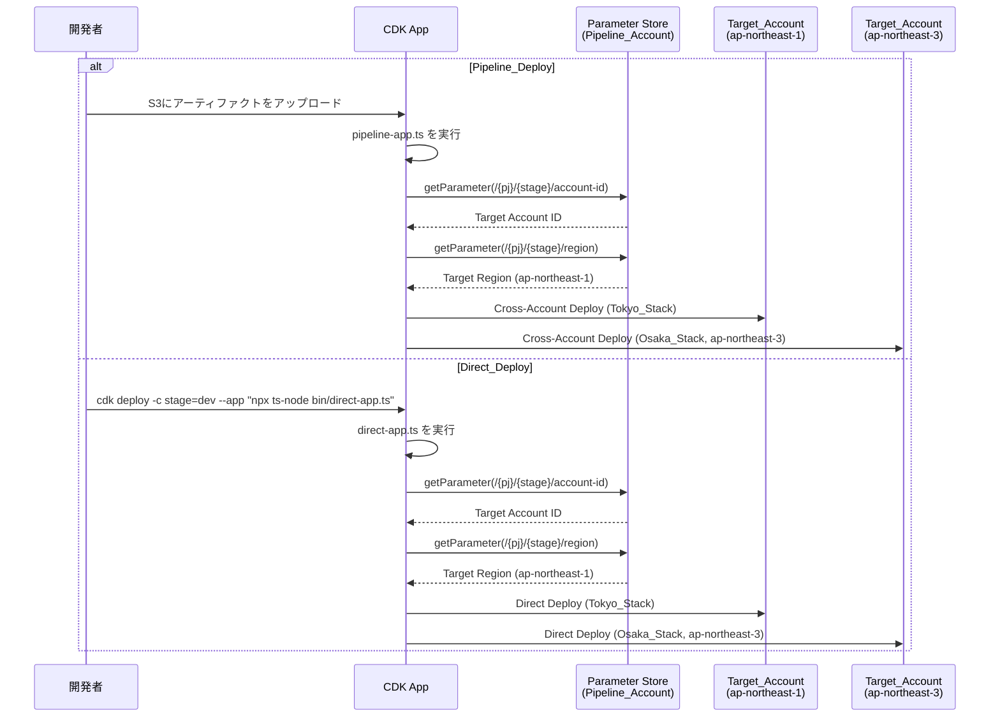
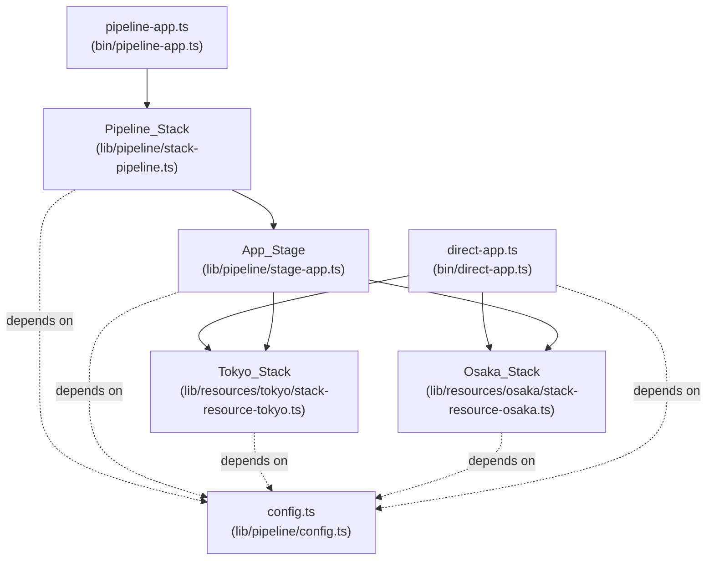

# 設計ドキュメント: CDK Pipeline Sample

## Overview

本プロジェクトは、AWS CDK Pipelines を使用したクロスアカウントデプロイのサンプル実装である。S3 バケットをソースとしたパイプライン実行により、Pipeline_Account から Target_Account（Dev/Prd）へリソースをデプロイする。各ステージでは東京リージョン（ap-northeast-1）と大阪リージョン（ap-northeast-3）の両方にリソースをデプロイし、大阪リージョンは災害対策（DR）用として東京とは異なるリソース構成を持つ。

開発効率向上のため、パイプライン経由（Pipeline_Deploy）と `cdk deploy` コマンドによる直接デプロイ（Direct_Deploy）の2つのエントリポイントを提供する。

デプロイ先アカウント情報は Pipeline_Account の AWS Systems Manager Parameter Store で一元管理し、両方のデプロイパスから同一のパラメータを参照する設計とする。

## Architecture

### 全体アーキテクチャ図（クロスアカウント・マルチリージョン構成）



### 2つのデプロイパス



### Parameter Store 参照フロー



## Components and Interfaces

### ファイル構成

```
cdk/
├── bin/
│   ├── pipeline-app.ts        # Pipeline_Deploy エントリポイント
│   └── direct-app.ts          # Direct_Deploy エントリポイント
├── lib/
│   ├── pipeline/              # パイプライン基盤（初期構築後ほぼ変更しない）
│   │   ├── config.ts          # プロジェクト設定（集中管理）
│   │   ├── stack-pipeline.ts  # Pipeline_Stack 定義
│   │   └── stage-app.ts       # App_Stage 定義
│   └── resources/             # デプロイ対象リソース（開発者が日常的に追加・修正）
│       ├── tokyo/             # 東京リージョン用リソース
│       │   └── stack-resource-tokyo.ts
│       └── osaka/             # 大阪リージョン（DR）用リソース
│           └── stack-resource-osaka.ts
├── cdk.json
├── package.json
└── tsconfig.json
```

`lib/pipeline/` は初期構築後ほぼ変更しない CI/CD 基盤、`lib/resources/` は開発者が日常的に追加・修正するデプロイ対象リソース。`lib/resources/tokyo/` と `lib/resources/osaka/` はリージョンごとに独立したリソース構成を持つ。

### コンポーネント詳細

#### 1. config.ts（設定の集中管理）

```typescript
export const config = {
  projectName: "cp002",
  region: "ap-northeast-1",
  drRegion: "ap-northeast-3",
  stages: {
    dev: "dev",
    prd: "prd",
  },
  accounts: {
    pipeline: {
      id: "PIPELINE_ACCOUNT_ID",
      alias: "pipeline",
    },
    targets: [
      { stage: "dev", id: "DEV_ACCOUNT_ID", alias: "dev" },
      { stage: "prd", id: "PRD_ACCOUNT_ID", alias: "prd" },
    ],
  },
  sourceBucket: {
    name: "s3-cp002-source",
  },
  parameterStore: {
    prefix: "/cp002",
  },
} as const;

export type StageName = (typeof config.stages)[keyof typeof config.stages];
```

#### 2. pipeline-app.ts（Pipeline_Deploy エントリポイント）

```typescript
#!/usr/bin/env node
import * as cdk from "aws-cdk-lib";
import { PipelineStack } from "../lib/pipeline/stack-pipeline";
import { config } from "../lib/pipeline/config";

const app = new cdk.App();

new PipelineStack(app, `stack-${config.projectName}-pipeline`, {
  env: {
    account: process.env.CDK_DEFAULT_ACCOUNT,
    region: config.region,
  },
});

app.synth();
```

#### 3. direct-app.ts（Direct_Deploy エントリポイント）

```typescript
#!/usr/bin/env node
import * as cdk from "aws-cdk-lib";
import * as ssm from "aws-cdk-lib/aws-ssm";
import { TokyoResourceStack } from "../lib/resources/tokyo/stack-resource-tokyo";
import { OsakaResourceStack } from "../lib/resources/osaka/stack-resource-osaka";
import { config, StageName } from "../lib/pipeline/config";

const app = new cdk.App();

// コンテキストまたは環境変数からステージを取得
const stage = (app.node.tryGetContext("stage") ||
  process.env.DEPLOY_STAGE ||
  "dev") as StageName;

// Parameter Store から Target Account 情報を取得
const targetAccountId = ssm.StringParameter.valueFromLookup(
  app, `${config.parameterStore.prefix}/${stage}/account-id`
);
const targetRegion = ssm.StringParameter.valueFromLookup(
  app, `${config.parameterStore.prefix}/${stage}/region`
);

// 東京リージョン（メイン）
new TokyoResourceStack(app, `stack-${config.projectName}-${stage}-tokyo`, {
  env: {
    account: targetAccountId,
    region: targetRegion,
  },
  stageName: stage,
  stackName: `stack-${config.projectName}-${stage}-tokyo`,
});

// 大阪リージョン（DR）
new OsakaResourceStack(app, `stack-${config.projectName}-${stage}-osaka`, {
  env: {
    account: targetAccountId,
    region: config.drRegion,
  },
  stageName: stage,
  stackName: `stack-${config.projectName}-${stage}-osaka`,
});

app.synth();
```

#### 4. stack-pipeline.ts（Pipeline_Stack）

```typescript
import * as cdk from "aws-cdk-lib";
import { Construct } from "constructs";
import * as s3 from "aws-cdk-lib/aws-s3";
import * as ssm from "aws-cdk-lib/aws-ssm";
import {
  CodePipeline,
  CodePipelineSource,
  ShellStep,
} from "aws-cdk-lib/pipelines";
import { AppStage } from "./stage-app";
import { config } from "./config";

export class PipelineStack extends cdk.Stack {
  constructor(scope: Construct, id: string, props?: cdk.StackProps) {
    super(scope, id, props);

    const pj = config.projectName;

    // S3 Source Bucket（バージョニング有効）
    const sourceBucket = new s3.Bucket(this, "SourceBucket", {
      bucketName: config.sourceBucket.name,
      versioned: true,
      removalPolicy: cdk.RemovalPolicy.RETAIN,
    });

    // S3 ソース
    const source = CodePipelineSource.s3(sourceBucket, "source.zip");

    // CodePipeline
    const pipeline = new CodePipeline(this, "Pipeline", {
      pipelineName: `cp-${pj}-deploy`,
      crossAccountKeys: true, // クロスアカウントデプロイに必要
      synth: new ShellStep("Synth", {
        input: source,
        commands: ["cd cdk", "npm ci", "npx cdk synth"],
        primaryOutputDirectory: "cdk/cdk.out",
      }),
    });

    // Parameter Store から Target Account 情報を取得
    const devAccountId = ssm.StringParameter.valueFromLookup(
      this, `${config.parameterStore.prefix}/dev/account-id`
    );
    const devRegion = ssm.StringParameter.valueFromLookup(
      this, `${config.parameterStore.prefix}/dev/region`
    );
    const prdAccountId = ssm.StringParameter.valueFromLookup(
      this, `${config.parameterStore.prefix}/prd/account-id`
    );
    const prdRegion = ssm.StringParameter.valueFromLookup(
      this, `${config.parameterStore.prefix}/prd/region`
    );

    // Dev Stage
    pipeline.addStage(
      new AppStage(this, "Dev", {
        env: { account: devAccountId, region: devRegion },
        stageName: config.stages.dev,
      })
    );

    // Prd Stage（手動承認付き）
    pipeline.addStage(
      new AppStage(this, "Prd", {
        env: { account: prdAccountId, region: prdRegion },
        stageName: config.stages.prd,
      }),
      {
        pre: [new cdk.pipelines.ManualApprovalStep("PromoteToPrd")],
      }
    );
  }
}
```

#### 5. stage-app.ts（App_Stage）

```typescript
import * as cdk from "aws-cdk-lib";
import { Construct } from "constructs";
import { TokyoResourceStack } from "../resources/tokyo/stack-resource-tokyo";
import { OsakaResourceStack } from "../resources/osaka/stack-resource-osaka";
import { config, StageName } from "./config";

export interface AppStageProps extends cdk.StageProps {
  stageName: StageName;
}

export class AppStage extends cdk.Stage {
  constructor(scope: Construct, id: string, props: AppStageProps) {
    super(scope, id, props);

    // 東京リージョン（メイン）
    new TokyoResourceStack(this, `stack-${config.projectName}-${props.stageName}-tokyo`, {
      env: {
        account: props.env?.account,
        region: config.region,
      },
      stageName: props.stageName,
      stackName: `stack-${config.projectName}-${props.stageName}-tokyo`,
    });

    // 大阪リージョン（DR）
    new OsakaResourceStack(this, `stack-${config.projectName}-${props.stageName}-osaka`, {
      env: {
        account: props.env?.account,
        region: config.drRegion,
      },
      stageName: props.stageName,
      stackName: `stack-${config.projectName}-${props.stageName}-osaka`,
    });
  }
}
```

#### 6. stack-resource-tokyo.ts（Tokyo_Stack）

```typescript
import * as cdk from "aws-cdk-lib";
import { Construct } from "constructs";
import * as s3 from "aws-cdk-lib/aws-s3";
import * as sqs from "aws-cdk-lib/aws-sqs";
import { config, StageName } from "../../pipeline/config";

export interface TokyoResourceStackProps extends cdk.StackProps {
  stageName: StageName;
}

export class TokyoResourceStack extends cdk.Stack {
  constructor(scope: Construct, id: string, props: TokyoResourceStackProps) {
    super(scope, id, props);

    const pj = config.projectName;
    const { stageName } = props;

    // サンプル S3 バケット
    new s3.Bucket(this, "SampleBucket", {
      bucketName: `s3-${pj}-${stageName}-sample`,
      blockPublicAccess: s3.BlockPublicAccess.BLOCK_ALL,
      encryption: s3.BucketEncryption.S3_MANAGED,
      removalPolicy: cdk.RemovalPolicy.DESTROY,
      autoDeleteObjects: true,
    });

    // サンプル SQS キュー
    new sqs.Queue(this, "SampleQueue", {
      queueName: `sqs-${pj}-${stageName}-sample`,
      retentionPeriod: cdk.Duration.days(4),
    });
  }
}
```

#### 7. stack-resource-osaka.ts（Osaka_Stack / DR）

```typescript
import * as cdk from "aws-cdk-lib";
import { Construct } from "constructs";
import * as s3 from "aws-cdk-lib/aws-s3";
import { config, StageName } from "../../pipeline/config";

export interface OsakaResourceStackProps extends cdk.StackProps {
  stageName: StageName;
}

export class OsakaResourceStack extends cdk.Stack {
  constructor(scope: Construct, id: string, props: OsakaResourceStackProps) {
    super(scope, id, props);

    const pj = config.projectName;
    const { stageName } = props;

    // DR 用 S3 バケット（東京とは異なる構成）
    // - バージョニング有効（DR データ保全のため）
    // - ライフサイクルルールで古いバージョンを90日後に削除
    new s3.Bucket(this, "DrBucket", {
      bucketName: `s3-${pj}-${stageName}-dr`,
      blockPublicAccess: s3.BlockPublicAccess.BLOCK_ALL,
      encryption: s3.BucketEncryption.S3_MANAGED,
      versioned: true,
      removalPolicy: cdk.RemovalPolicy.RETAIN,
      lifecycleRules: [
        {
          noncurrentVersionExpiration: cdk.Duration.days(90),
        },
      ],
    });
  }
}
```

## Data Models

### 設定データ構造

```typescript
// config.ts の型定義
interface Config {
  readonly projectName: string;
  readonly region: string;
  readonly drRegion: string;
  readonly stages: {
    readonly dev: "dev";
    readonly prd: "prd";
  };
  readonly accounts: {
    readonly pipeline: {
      readonly id: string;
      readonly alias: string;
    };
    readonly targets: ReadonlyArray<{
      readonly stage: string;
      readonly id: string;
      readonly alias: string;
    }>;
  };
  readonly sourceBucket: {
    readonly name: string;
  };
  readonly parameterStore: {
    readonly prefix: string;
  };
}
```

### Parameter Store パラメータ構造

| パラメータ名 | 説明 | 例 |
|---|---|---|
| `/{pj}/dev/account-id` | Dev 環境のアカウント ID | `123456789012` |
| `/{pj}/dev/region` | Dev 環境のリージョン | `ap-northeast-1` |
| `/{pj}/prd/account-id` | Prd 環境のアカウント ID | `987654321098` |
| `/{pj}/prd/region` | Prd 環境のリージョン | `ap-northeast-1` |

### CDK Stack 間の依存関係



## Error Handling

### Parameter Store 取得エラー

| エラーケース | 対応 |
|---|---|
| パラメータが存在しない | CDK synth 時に `valueFromLookup` が `dummy-value-for-*` を返す。実際のデプロイ時にエラーとなり中断 |
| 権限不足 | IAM ポリシーエラーとして CDK CLI がエラーメッセージを表示 |
| パラメータ値が不正（空文字等） | CDK の `env` に空文字が設定され、スタックデプロイ時に CloudFormation がエラーを報告 |

### デプロイエラー

| エラーケース | 対応 |
|---|---|
| クロスアカウント権限不足 | CDK Pipelines の bootstrap 未実行を示唆するエラーメッセージが表示される。Target_Account で `cdk bootstrap --trust PIPELINE_ACCOUNT_ID` の実行が必要 |
| 大阪リージョンの bootstrap 未実行 | Target_Account の ap-northeast-3 でも `cdk bootstrap` が必要。東京と大阪の両リージョンで bootstrap を実行すること |
| S3 Source Bucket が空 | パイプラインが起動しない（トリガーが発火しない） |
| Synth Step 失敗 | パイプライン実行が Synth ステージで失敗。CodeBuild ログでエラー内容を確認 |
| 手動承認タイムアウト | パイプラインがタイムアウトし、Prd デプロイがスキップされる |
| 東京デプロイ成功・大阪デプロイ失敗 | 同一ステージ内の部分的失敗。パイプラインはステージ全体を失敗として扱う。大阪リージョンの権限・bootstrap を確認 |

### Direct_Deploy エラー

| エラーケース | 対応 |
|---|---|
| ステージ指定なし | デフォルト値 `dev` が使用される |
| 無効なステージ名 | TypeScript の型チェックでコンパイルエラー |
| Target_Account への認証情報なし | AWS CLI/SDK がエラーを報告。`--profile` オプションまたは環境変数の設定が必要 |
| 大阪リージョンへのデプロイ権限なし | Target_Account の大阪リージョンに対する IAM 権限を確認。クロスリージョンデプロイの場合、リージョン固有の権限設定が必要な場合がある |
